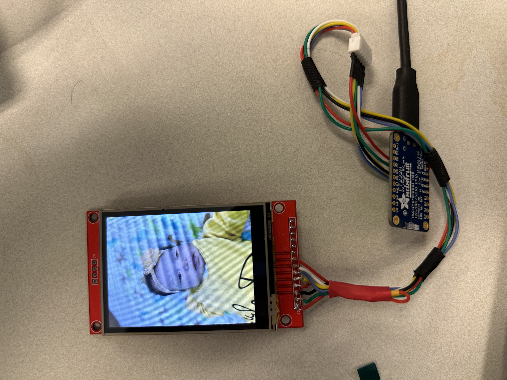

# Python Library for ILI9341 Driven LCD displays Connected with 4-wire SPI

This library implements a python driver for SPI-connected ILI9341 LCD displays.
Only the 4-wire SPI interface having an additional data-control select pin
`DC/X` is supported.

It takes inspiration from `Adafruit_Python_ILI9341` project. Most constants and
some of the timing values are copied as is. The focus is to display arbitrary
image in the display and increase SPI bandwidth-limited framerate by doing
automatic partial updates.

## Advantages

- Supports a variety of hardware and software interfaces:
  - spidev + gpiod
  - mraa
  - pyftdi
- Fast and efficient buffer update, taking advantage of the partial update
  commands of the ILI9341 chip.


## Hardware Connections

The host needs to have an SPI connection along with a general GPIO output for
the `DC/X` pin. The library does one way communication only and as such, the
`MISO` pin can be left unconnected. Connections for the tests are described in
the test scripts and is printed during test invocation.

The tests were done using a
[2.8inch ILI9341 display](http://www.lcdwiki.com/2.8inch_SPI_Module_ILI9341_SKU:MSP2807).
The datasheet of the LCD driver chip can be found
[here](https://cdn-shop.adafruit.com/datasheets/ILI9341.pdf).




## Installation and Testing

- [Spidev + Gpiod in Ubuntu 22.04](docs/ubuntu_22.04_spidev_setup.md)
- [Pyftdi in Ubuntu 22.04](docs/ubuntu_22.04_pyftdi_setup.md)
- [Mraa in Ubuntu 22.04](docs/ubuntu_22.04_mraa_setup.md)


## Usage examples

Here some examples of using different interfaces with Raspberry Pi 3B+.

### Using Spidev + Gpiod Interface

```python
from ili9341.ili9341_spidev import Ili9341Spidev

# Hardware connection:
# ------------------------------------------------------------------
# [RPi2B Compat. Host]   <---> [Display]
# ==================================================================
# Pin-19/GPIO-10/MOSI    <---> MOSI (Main-Out-Sub-In)
# Pin-23/GPIO-11/SCLK    <---> SCLK (SPI-Clock)
# Pin-24/GPIO-8/SPI0-CE0 <---> CS/X (SPI-Chip-Select)
# Pin-22/GPIO-25         <---> DC/X (Data/Control Select for ILI9341)
# 3.3V+                  <---> RST (We are not using reset pin)
# 3.3V+                  <---> LED (No software illumination control)

lcd = Ili9341Spidev(
    spidev_device_path="/dev/spidev0.0",
    gpiod_device_path="/dev/gpiochip0",
    dcx_pin_id=25,
    rst_pin_id=None,
    spi_clock_hz=42_000_000,
    spi_data_chunk_size=2048)

# Clear the screen to white.
lcd.clear((0xFF, 0xFF, 0xFF))

# Draw a red rectangle.
lcd.framebuff[10:20, 10:40, :] = (0xFF, 0, 0)
lcd.update()
```

### Using Pyftdi Interface

```python
from ili9341.ili9341_pyftdi import Ili9341Pyftdi

# Hardware connection:
# -------------------------------------------------------------------
# [FT232H] <---> [Display]
# ===================-===============================================
# D0       <---> SCLK (SPI-Clock)
# D1       <---> MOSI (Main-Out-Sub-In)
# D3       <---> CS/X (SPI-Chip-Select)
# D4       <---> DC/X (Data/Control Select for ILI9341)
# 3.3V+    <---> RST (We are not using reset pin)
# 3.3V+    <---> LED (No software illumination control)

lcd = Ili9341Pyftdi(
    pyftdi_interface_path="ftdi://ftdi:232h/1",
    dcx_pin_id=4,
    rst_pin_id=None,
    spi_clock_hz=42_000_000,
    spi_data_chunk_size=2048)

# Clear the screen to white.
lcd.clear((0xFF, 0xFF, 0xFF))

# Draw a red rectangle.
lcd.framebuff[10:20, 10:40, :] = (0xFF, 0, 0)
lcd.update()
```


### Using Mraa Interface

```python
from ili9341.ili9341_mraa import Ili9341Mraa

# Hardware connection:
# ------------------------------------------------------------------
# [RPi2B Compat. Host]   <---> [Display]
# ==================================================================
# Pin-19/GPIO-10/MOSI    <---> MOSI (Main-Out-Sub-In)
# Pin-23/GPIO-11/SCLK    <---> SCLK (SPI-Clock)
# Pin-24/GPIO-8/SPI0-CE0 <---> CS/X (SPI-Chip-Select)
# Pin-22/GPIO-25         <---> DC/X (Data/Control Select for ILI9341)
# 3.3V+                  <---> RST (We are not using reset pin)
# 3.3V+                  <---> LED (No software illumination control)

lcd = Ili9341Mraa(
    spi_id: 0,
    dcx_pin_id: 22,
    rst_pin_id=None,
    spi_clock_hz=42_000_000,
    spi_data_chunk_size=2048)

# Clear the screen to white.
lcd.clear((0xFF, 0xFF, 0xFF))

# Draw a red rectangle.
lcd.framebuff[10:20, 10:40, :] = (0xFF, 0, 0)
lcd.update()
```


## About the test data

The image and video inside the `tests/` directory are of my daughter. Isn't she
adorable? ^_^


## License

This software is distributed under MIT license. Look at `LICENSE` the license
file for the terms of distribution.


## Copyright

2024 Titon Barua <baruat@email.sc.edu, titon@vimmaniac.com>
